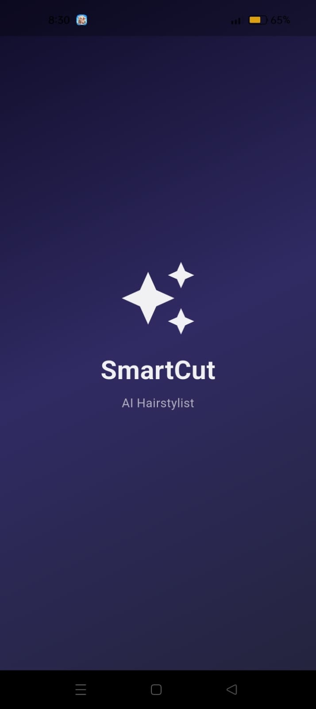
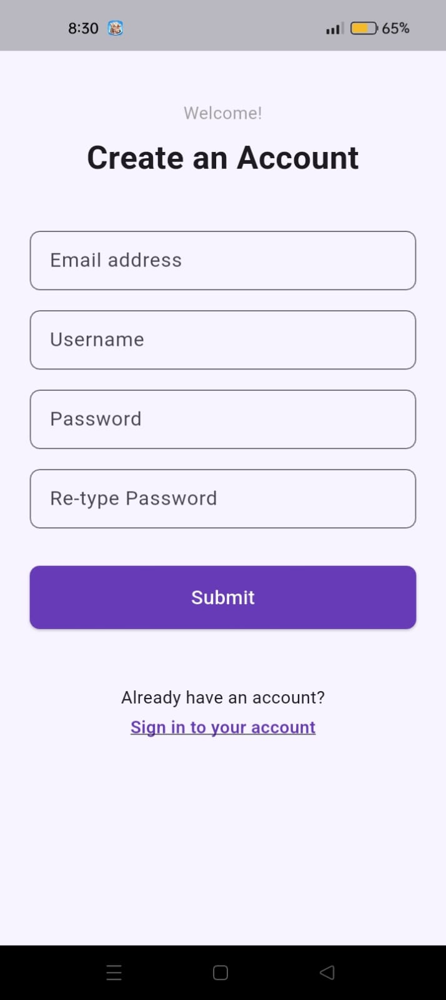
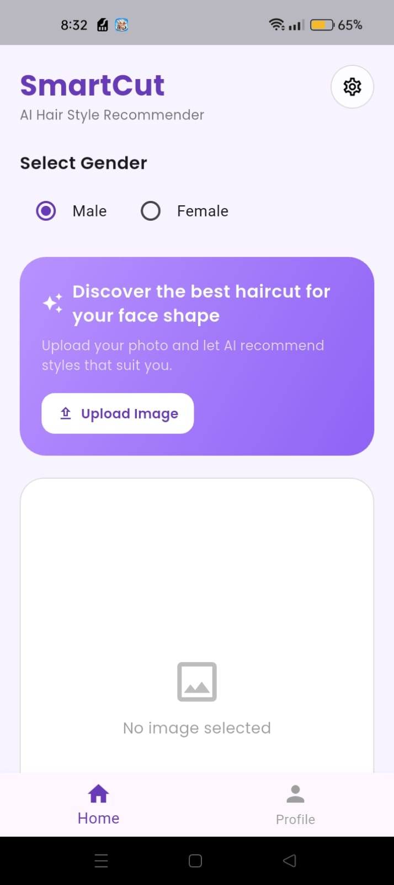
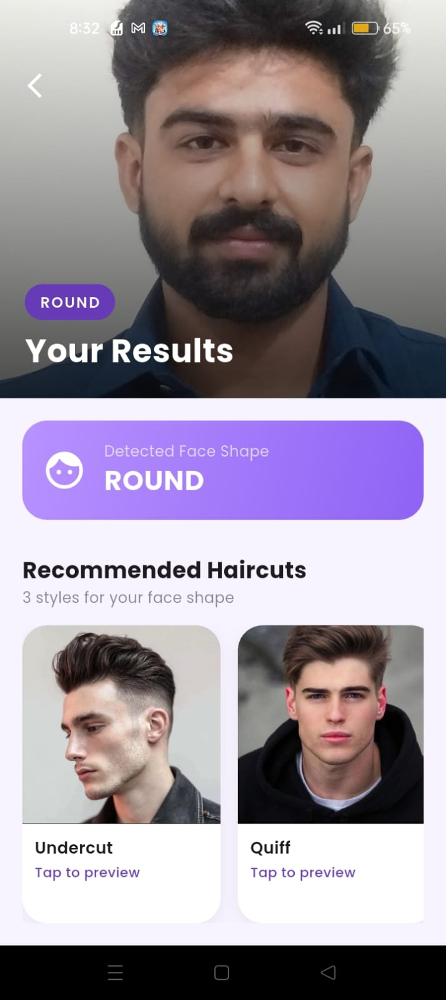
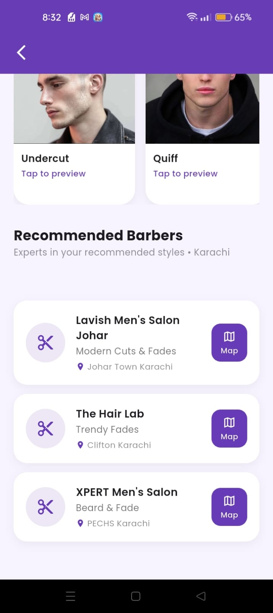
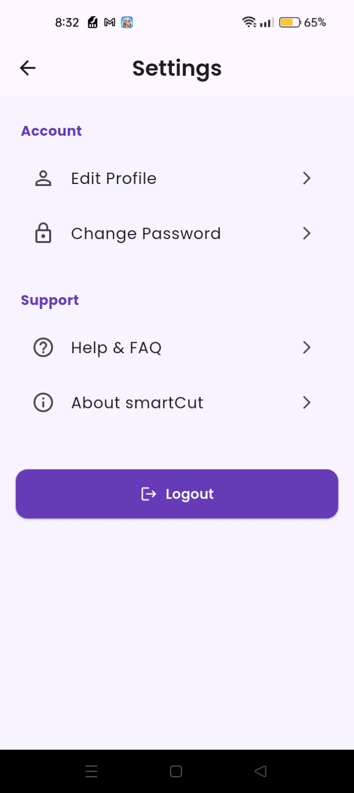
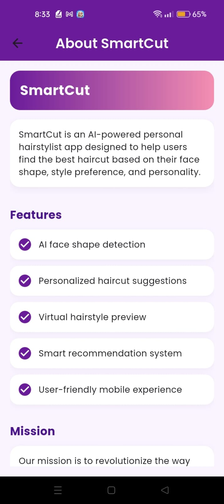

# SmartCut


AI-powered haircut recommendation app that analyzes your face shape and suggests hairstyles that suit you best.

## Overview

SmartCut is a mobile-first Flutter application built as a Final Year Project. It combines on-device computer vision with a lightweight recommendation system to give users personalized haircut suggestions based on their facial features — no manual input required.

## Problem Statement

Choosing a haircut that suits one's face shape is often guesswork — people rely on trial and error, salon advice, or trends rather than data-driven suggestions. SmartCut aims to solve this by using AI to analyze facial structure and recommend hairstyles suited to the individual, making the decision faster and more personalized.

## Dataset

The face shape classification dataset was sourced from Roboflow Universe: [Face Shape Dataset](https://universe.roboflow.com/faceshape-vxygg/faceshape-atkte).

It contains 8000 labeled facial images categorized by face shape which then increased to 15,734 images after augmentation, used to train the classification model that powers SmartCut's haircut recommendations.

The dataset was split into training and testing sets, with a 70/30 ratio. The training set was used to train the model, while the testing set was used to evaluate its performance.

Dataset consists of 5 classes:

- oval
- round
- square
- heart
- long

The dataset was preprocessed as follows:
1. Images were resized to 224x224 pixels
2. Images were normalized to the range [-1, 1]
3. Images were augmented to increase the size of the dataset from 8000 to 15,734 images.

## Tools and Technologies

- **Framework:** Flutter (Dart)
- **ML Model:** MobileNetV3 (TensorFlow Lite)
- **Face Detection:** Google ML Kit
- **Authentication/Backend:** Firebase

## Methods

1. **Face Detection** — Google ML Kit detects and extracts facial landmarks from the input image.
2. **Face Shape Classification** — A MobileNetV3 model (converted to TFLite for on-device inference) classifies the detected face into a face-shape category.
3. **Recommendation** — Based on the classified face shape, the app maps and suggests suitable haircuts.
4. **Delivery** — Results are displayed to the user in the app UI in real time.

## Key Insights

Training was done using TensorFlow Keras with the following parameters:
- Batch size: 32
- Epochs: 30

The model was trained on Google Colab and saved in .tflite format for on-device inference.

### Test Accuracy

Test Accuracy: 0.8447546362876892

## Dashboard / Model / Output

### Splash Screen


### Signup


### Home Screen


### Result
 

### Profile


### Edit Profile


### Settings


### Change Password


### About and FAQ
 

## How to Run this Project

### Prerequisites

- Flutter SDK installed
- Firebase project set up (Authentication enabled)

### Installation

```bash
git clone https://github.com/shahbakht-jalil/smartCut-app.git
cd smartCut-app
flutter pub get
```

### Run

```bash
flutter run
```

## Results & Conclusion

The final application successfully detects a user's face shape (e.g. Round, Oval, Square) and generates personalized haircut recommendations in real time. Along with style suggestions, the app also recommends nearby barbers in the user's city offering those specific styles, along with their location on a map.

The model achieved a test accuracy of 84.47%, providing reliable face shape classification for practical, everyday use. Overall, SmartCut demonstrates that an on-device ML pipeline can deliver fast, personalized grooming recommendations without relying on manual input or server-side processing.

## Future Work

- Expand the barber recommendation feature to more cities beyond Karachi
- Increase dataset size and diversity to improve classification accuracy across more face shapes and skin tones
- Add a virtual try-on (AR-based) feature to preview haircuts before visiting a barber
- Extend haircut recommendations for female users with a wider style library
- Allow users to book appointments directly with recommended barbers within the app

## Author

Bakht — Final Year Computer Science Student, SZABIST University
